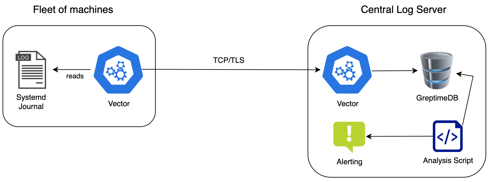

## Preface

### Goal

The following documentation describes how to set up a central log server to keep track of all user login activity
on Linux systems.

- The system forwards all relevant log messages from the systemd journal to a central log server.
- Message transfer will be encrypted and authenticated using TLS so you can expose the central log server
  to the public internet and receive messages from everywhere.
- [Vector](https://vector.dev/) is used as log collector and central log server.
- [GreptimeDB](https://greptime.com/product/db) is used as time-series database for storing the logs.



### ISO 27001 context

ISO 27001 requires the following:

> A.12.4.1 Event logging
> Event logs recording user activities, exceptions, faults and information security events shall 
> be produced, kept and regularly reviewed.

> A.12.4.3 Administrator and operator logs
> System administrator and system operator activities shall be logged and the logs protected and regularly reviewed.

In other words:

- Log ALL remote access attempts (success/failure)
- WHO accessed WHAT system WHEN
- Protect logs from tampering
- Regular log review (weekly/monthly)

The requirement "Protect logs from tampering" is vague. Keep in mind, ISO 27001 accepts that perfect security is 
impossible. It wants reasonable, documented controls based on your risk assessment.
There will always be users with the right to delete the hard disk with your central logs stored on it.
But we know, opportunity makes the thief. So don't make it too easy to cover up the traces of unauthorized system access.

## Install GreptimeDB (Receiver Side)

We will use [GreptimeDB](https://greptime.com/product/db) as the database backend of a central log server. 
GreptimeDB is designed for efficient log storage. It comes with auto deletion of records according to a retention policy
and it provides an append only mode. The latter makes it impossible to delete or alter records in the database.
Dropping an entire database or wiping the hard disk is still possible. But it's is a significant hurdle and requires
criminal intent.

### Download and install

> [!IMPORTANT]
> Go to the [GreptimeDB release page](https://github.com/GreptimeTeam/greptimedb/releases) 
> and look for the latest **stable** version. 
> Change the version in the below snippet accordingly.

```bash
VERSION="0.15.2"
wget https://github.com/GreptimeTeam/greptimedb/releases/download/v${VERSION}/greptime-linux-amd64-v${VERSION}.tar.gz
tar -xzf greptime-linux-amd64-v${VERSION}.tar.gz -C /usr/local/bin --strip-components=2 greptime-linux-amd64-v${VERSION}/greptime
/usr/local/bin/greptime --version
rm greptime-linux-amd64-v${VERSION}.tar.gz
```

### Create user and configuration

Create a user:

```bash
mkdir /etc/greptime
useradd -d /var/lib/greptime -m -r -s /bin/false greptime
```

Create a base server config:

```bash
cat << EOF > /etc/greptime/standalone.toml
#
# Refer to https://github.com/GreptimeTeam/greptimedb/blob/v0.15.2/config/standalone.example.toml
# and https://docs.greptime.com/user-guide/deployments-administration/configuration
# for all configuration options
#
## The HTTP server options.
[http]
# The address to bind the HTTP server.
addr = "127.0.0.1:4000"

## MySQL server options.
[mysql]
## Whether to enable.
enable = true
## The addr to bind the MySQL server.
addr = "127.0.0.1:4002"

## PostgresSQL server options.
[postgres]
## Whether to enable
enable = false

[storage]
type = "File"
data_home = "/var/lib/greptime"
EOF
```

Create database users:

```bash
cat << EOF > /etc/greptime/users.conf
admin=$(openssl rand -hex 10)
vector=$(openssl rand -hex 10)
EOF
```

The above step creates two users. `admin` that is used for admin tasks and analysis and `vector` that is used
for the vector daemon to connect to the database.

> [!WARNING]
> GreptimeDB as of version 0.15.X supports authentication but it lacks authorization.
> All users will have all rights, even to execute a `DROP DATABASE` command.
> **Do not expose the GreptimeDB HTTP and MySQL ports.** Always bind them to localhost.

### Run GreptimeDB

Create a systemd service:

```bash
cat << EOF > /etc/systemd/system/greptime.service
[Unit]
Description=GreptimeDB Database Server
After=network.target
Wants=network.target

[Service]
Type=simple
User=greptime
Group=greptime
WorkingDirectory=/var/lib/greptime
ExecStart=/usr/local/bin/greptime standalone start \
    --config-file /etc/greptime/standalone.toml \
    --user-provider=static_user_provider:file:/etc/greptime/users.conf
RestartSec=10
StandardOutput=journal
StandardError=journal

[Install]
WantedBy=multi-user.target
EOF
```

Start the database service:

```bash
systemctl daemon-reload
systemctl enable --now greptime
systemctl status greptime
```

### Test GreptimeDB
If your system lacks a MySQL command line client, install one. The version doesn't matter.
Also it doesn't matter whether the client is from MariaDB or from the original MySQL DB.

```bash
sudo apt install default-mysql-client
```

Now test your GreptimeDB installation.

```
mysql -h 127.0.0.1 --port 4002 -u admin -p
```

Enter the password for the user admin grabbed from `/etc/greptime/users.conf`.

### Create a mysql client configuration

Create a `.my.cnf` file for quick and passwordless connections.

```bash
cat << EOF > ~/.my.cnf
[client]
host = 127.0.0.1
port = 4002
user = admin
password = <PASSWORD_FROM_/etc/greptime/users.conf>
database = vector
EOF
chmod 0600 ~/.my.cnf
```

Now execute the `mysql` command line client without any arguments, and you will be connected.

### Create a database

With your GreptimeDB running, create a database for Vector to store log messages.
**Adjust the retention policy** (ttl='3months') to your needs.
Read more about [ttls and automated records removal](https://docs.greptime.com/user-guide/manage-data/overview#manage-data-retention-with-ttl-policies).
Omitting `WITH (ttl = '3months')` is also possible, to disable auto-removal.

```bash
mysql -e "CREATE DATABASE vector WITH (ttl = '3months')"
```

GreptimeDB is now ready to store log messages from Vector.

> [!NOTE]
> You don't have to create tables. Vector will do this for you.

### Query the database via HTTP

At this time your database will not have tables or records. It's worth to mention that you can query the database
via HTTP too. Test it later once you have data stored.

```bash
curl -s -X POST \
  -u 'admin:<YOUR_PASSWORD>' \
  -H 'Content-Type: application/x-www-form-urlencoded' \
  -d 'sql=select * from logs limit 1' \
  -d 'format=table' \
http://localhost:4000/v1/sql?db=vector|jq
```

## Install Vector Log Server (Receiver Side)

### Install Vector

Vector comes as Debian package. The installation is straight forward.

```bash
bash -c "$(curl -Ls https://setup.vector.dev)"
sudo apt-get install vector
systemctl enable --now vector
```

### Create TLS keys and certificates

We will use TLS for encryption and authentication. Clients sending messages must present a valid client certificate 
to deliver messages.

```bash
cd /etc/vector
#Generate CA private key
openssl genrsa -out ca-key.pem 4096
#Generate CA certificate
openssl req -new -x509 -days 999 -key ca-key.pem -out ca-cert.pem -subj "/CN=Vector-CA"
#Generate server private key
openssl genrsa -out server-key.pem 4096
#Generate server certificate signing request
openssl req -new -key server-key.pem -out server.csr -subj "/CN=vector"
#Generate server certificate signed by CA
openssl x509 -req -days 365 -in server.csr -CA ca-cert.pem -CAkey ca-key.pem -CAcreateserial -out server-cert.pem
#Generate client private key
openssl genrsa -out client-key.pem 4096
#Generate client certificate signing request
openssl req -new -key client-key.pem -out client.csr -subj "/CN=vector-client"
#Generate client certificate signed by CA
openssl x509 -req -days 365 -in client.csr -CA ca-cert.pem -CAkey ca-key.pem -CAcreateserial -out client-cert.pem
#Clean up CSR files
rm server.csr client.csr
#Set permission
chgrp vector /etc/vector/server-key.pem
chmod g+r /etc/vector/server-key.pem
```

Copy over the client relevant files `ca-cert.pem`, `client-cert.pem` and `client-key.pem` to all machines that will 
ship journal messages to the central server.

Example:

```
cd /etc/vector/
scp ca-cert.pem client-cert.pem client-key.pem user@client-machine:/etc/vector/
```

> [!WARNING]
> This is a simplified setup that uses a single certificate for all machines (sender side).
> Consider creating individual certificates.

### Create a Vector configuration

The below example will make Vector listening on TCP 3003 with TLS encryption enabled.
All incoming log messages will be stored in GreptimeDB using the HTTP interface.

In the `sink` section, replace the username and password pair with valid GreptimeDB credentials as created in the
previous steps. Refer to `/etc/greptime/users.conf`.  

```bash
cat << EOF > /etc/vector/vector.yaml
# Vector configuration for receiving syslog over TCP and writing to files and GreptimeDB
sources:
  vector:
    type: vector
    version: "2"
    address: "0.0.0.0:3003"
    tls:
      enabled: true
      key_file: "/etc/vector/server-key.pem"
      crt_file: "/etc/vector/server-cert.pem"
      ca_file: "/etc/vector/ca-cert.pem"
      verify_certificate: true
      verify_hostname: false

sinks:
  greptime_output:
    type: "greptimedb_logs"
    inputs:
      - vector
    endpoint: "http://127.0.0.1:4000"
    dbname: "vector"
    table: "logs"
    password: <PASSWORD_FROM_/etc/greptime/users.conf>
    username: vector
EOF
```

Restart Vector to activate the configuration. Look for errors like Vector cannot connect to the database.

```bash
systemctl restart vector
journalctl -u vector
```

The journal should show you three checkmarks:

```bash
Jul 16 11:12:07 my-host systemd[1]: Starting vector.service - Vector...
Jul 16 11:12:07 my-host vector[193]: √ Loaded ["/etc/vector/vector.yaml"]
Jul 16 11:12:07 my-host vector[193]: √ Component configuration
Jul 16 11:12:07 my-host vector[193]: √ Health check "greptime_output"
```

> [!NOTE]
> If you have a firewall enabled, open the TCP port of Vector, 3003 in the above example.

### Browse the logs

```
mysql -e "SELECT * FROM logs ORDER BY greptime_timestamp DESC LIMIT 2"
mysql -e "SELECT greptime_timestamp as date,host,message,\`SYSLOG_IDENTIFIER\` \
    FROM logs \
    ORDER BY greptime_timestamp DESC LIMIT 10"
```

> [!NOTE]
> You won't get any results or you will get an error about the missing log table.
> This is expected because nobody is delivering messages yet.
> But you have learned how to query the database.

## Set up Log Forwarding (Sender Side)

On your fleet of machines, forward relevant logs from the systemd journal to your central Vector server.  
You will also use Vector for the log collection and forwarding.

### Install Vector

The installation is the same as for the server.

```bash
bash -c "$(curl -Ls https://setup.vector.dev)"
sudo apt-get install vector
systemctl enable --now vector
```

### Create a configuration

The below snippet will create a Vector configuration that will continuously read the journal (source) and forward all messages
matching the condition (transform) to the remote Vector server (sink).

Replace `address: "<SERVER_IP_OR_HOST_NAME>:3003"` with your Vector server details.

```bash
cat << EOF > /etc/vector/vector.yaml
# Vector configuration for collecting systemd journal logs and forwarding to remote vector
sources:
  systemd_journal:
    type: journald
    journal_directory: "/run/log/journal"
    current_boot_only: false

transforms:
  my_filter:
    type: filter
    inputs:
      - systemd_journal
    # Forward only messages created by specific applications. 
    condition: 'includes(["sshd", "sudo", "su"], .SYSLOG_IDENTIFIER)'

sinks:
  remote_vector:
    type: vector
    inputs:
      - my_filter
    address: "<SERVER_IP_OR_HOST_NAME>:3003"
    compression: true
    tls:
      enabled: true
      ca_file: "/etc/vector/ca-cert.pem"
      crt_file: "/etc/vector/client-cert.pem"
      key_file: "/etc/vector/client-key.pem"
      verify_certificate: true
      verify_hostname: false
EOF
```

Adjust file permissions

```bash
chgrp vector /etc/vector/client-key.pem
chmod g+r /etc/vector/client-key.pem
```

> [!IMPORTANT]
> Before starting Vector make sure you have copied the TLS certificates and keys from the server side to the sender side.

Finally, restart Vector to activate the new configuration.

```bash
systemctl restart vector
journalctl -u vector
```

You should see a process like `journalctl --follow --all --show-cursor ...` run by the Vector user in your process list.

### Potential problems with none-uniq host names

> [!NOTE]
> The following configuration changes are optional. If the local hostnames are sufficient for identifying your machines,
> you can skip this step or come back to it later.

All messages from the journal captured by Vector will have a 'host' field filled with the local short hostname.
This is returned by the `hostname` command. The machine ID taken from `/etc/machine_id` will also be sent to the
central log server.

However, these two values may not be sufficient to uniquely identify a host. Vector allows you to enrich the data sent 
to the central log server with additional fields. This enables you to add a unique identifier, such as an inventory 
number or fully qualified domain name (FQDN) that may have been predefined by another system, such as a CMDB or your 
Ansible inventory. The magic happens in the transforms section of the `vector.yaml` configuration file.

The below example adds two additional fields.

```yaml
sources:
  systemd_journal:
    type: journald
    journal_directory: "/run/log/journal"
    current_boot_only: false

transforms:
  add_fields:
    type: remap
    inputs:
      - systemd_journal
    source: |
      .fqdn = "daisy.localnet.local" # <----- Insert your FQDN here
      .cmdb_id = "4711-0815-abc"     # <----- Insert your CMDB ID here

  my_filter:
    type: filter
    inputs:
      - add_fields
    # Forward only messages created by specific applications. 
    condition: 'includes(["sshd", "sudo", "su"], .SYSLOG_IDENTIFIER)'

sinks:
  remote_vector:
    type: vector
    inputs:
      - my_filter
    address: "192.168.178.127:3003"
    compression: true
    tls:
      enabled: true
      ca_file: "/etc/vector/ca-cert.pem"
      crt_file: "/etc/vector/client-cert.pem"
      key_file: "/etc/vector/client-key.pem"
      verify_certificate: true
      verify_hostname: false
```

Read the file from bottom to top. 
- "Sink" is the final destination of the messages. It's the remote Vector server.
- The sink asks the transformer `my_filter` for data.
- `my_filter` asks `add_fields` for data but it discards everything not matching the condition expression.
- `add_fields` asks the `systemd_journal` source to read messages from the system journal.

Replace the values of `.fqdn` and `.cmdb_id` with real values. This is typically done by Ansible or some other
configuration management tool.

> [!TIP]
> Don't care about new columns on the remote servers database. GreptimeDB will create them automatically
> on receiving data.

### Test

On the machine where Vector is reading and forwarding the journal messages, create a log message:

```bash
logger -t sshd "Sample message to test vector"
```

Or from some other machine, try a log in via SSH with an invalid password or an invalid user:

```bash
sshpass -p $RANDOM ssh lausbubenstreich@your-server
```

On the central Vector log server, query the GreptimeDB:

```
mysql -e "SELECT greptime_timestamp as date,host,message,\`SYSLOG_IDENTIFIER\`,\`_PID\` \
    FROM logs \
    ORDER BY greptime_timestamp DESC LIMIT 20"
```

You should get multiple records with messages like "Failed password for invalid user lausbubenstreich from 
192.168.178.28 port 50688 ssh2".

If you don't get the messages on the Vector server, look for Vector errors on the sender side.

```bash
journalctl -u vector
```

### Group messages

Failed logins will generate multiple messages. If you look into your GreptimeDB, you will get results like the one below:

```text
# mysql -e "SELECT greptime_timestamp as date,host,message,\`_PID\` \
    FROM logs \
    ORDER BY greptime_timestamp DESC LIMIT 20"
+----------------------------+-------+--------------------------------------------------------------------------------------------------------+------+
| date                       | host  | message                                                                                                | _PID |
+----------------------------+-------+--------------------------------------------------------------------------------------------------------+------+
| 2025-07-16 10:19:31.430889 | daisy | Connection closed by invalid user lausbubenstreich 192.168.178.28 port 56510 [preauth]                 | 1146 |
| 2025-07-16 10:19:31.430864 | daisy | Failed password for invalid user lausbubenstreich from 192.168.178.28 port 56510 ssh2                  | 1146 |
| 2025-07-16 10:19:29.885126 | daisy | pam_unix(sshd:auth): authentication failure; logname= uid=0 euid=0 tty=ssh ruser= rhost=192.168.178.28 | 1146 |
| 2025-07-16 10:19:29.885116 | daisy | pam_unix(sshd:auth): check pass; user unknown                                                          | 1146 |
| 2025-07-16 10:19:29.885090 | daisy | Invalid user lausbubenstreich from 192.168.178.28 port 56510                                           | 1146 |
| 2025-07-16 09:57:38.682171 | daisy | Sample message to test vector                                                                          | 1140 |
| 2025-07-16 09:57:38.682148 | daisy | Sample message to test vector                                                                          | 1139 |
+----------------------------+-------+--------------------------------------------------------------------------------------------------------+------+
```

The failed SSH login has created five messages. Via the `_PID` column you can "group" them.

Unfortunately GreptimeDB does not support all SQL statement that you are used to from MySQL.
Joining all messages belonging to the same event with pure SQL is not possible.

The analysis script will do that for your.

## Run automated analysis and create alerts (receiver side)

This repository contains a small python script that looks for failed logins and other critical events in GreptimeDB.

### Install analysis script

- Download [activity-analysis.py](./activity-analysis.py) to the Vector server and make it executable.
- Install python MySQL 
  ```bash
  sudo apt-get install python3-pymysql
  ```
  
Check the command line options of the script:

```text
./activity-analysis.py --help
usage: activity-analysis.py [-h] [--db-host DB_HOST] [--db-port DB_PORT] --db-user DB_USER 
       --db-name DB_NAME [--since SINCE] [--data-dir DATA_DIR] [--since-last-run]

Query GreptimeDB for systemd journal messages

options:
  -h, --help           show this help message and exit
  --db-host DB_HOST    Database host (default: 127.0.0.1)
  --db-port DB_PORT    Database port (default: 4002)
  --db-user DB_USER    Database user (mandatory)
  --db-name DB_NAME    Database name (mandatory)
  --since SINCE        Show records older than this date, accepts date and time, e.g. "2025-07-15" or "2025-07-15 08:47:26"
  --data-dir DATA_DIR  Data directory (default: /var/tmp)
  --since-last-run     Continue querying starting from the timestamp of last run
```

The environment variable `GREPTIMEDB_PASSWORD` is required for the database authentication:

```bash
export GREPTIMEDB_PASSWORD=$(grep admin /etc/greptime/users.conf |cut -d= -f2)
```

Run the script for the first time:

```bash
./activity-analysis.py --db-user admin --db-name vector
```

You will get a list of events as shown in the following example:

```text
  HOST: daisy (ed880415acc14686870182ec8cc8acad)
  DATE: 2025-07-16 10:19:1752661169
   PID: 1146
   MSG: Invalid user lausbubenstreich from 192.168.178.28 port 56510
        pam_unix(sshd:auth): check pass; user unknown
        pam_unix(sshd:auth): authentication failure; logname= uid=0 euid=0 tty=ssh ruser= rhost=192.168.178.28
        Failed password for invalid user lausbubenstreich from 192.168.178.28 port 56510 ssh2
        Connection closed by invalid user lausbubenstreich 192.168.178.28 port 56510 [preauth]
------------------------------------------------------------------------------------------------------------------------
  HOST: daisy (ed880415acc14686870182ec8cc8acad)
  DATE: 2025-07-16 09:56:1752659811
   PID: 1133
   MSG: Invalid user wrongdoer-test from 192.168.178.28 port 55691
        pam_unix(sshd:auth): check pass; user unknown
        pam_unix(sshd:auth): authentication failure; logname= uid=0 euid=0 tty=ssh ruser= rhost=192.168.178.28
        Failed password for invalid user wrongdoer-test from 192.168.178.28 port 55691 ssh2
        Connection closed by invalid user wrongdoer-test 192.168.178.28 port 55691 [preauth]
        pam_unix(cron:session): session opened for user root by (uid=0)
        pam_unix(cron:session): session closed for user root
------------------------------------------------------------------------------------------------------------------------
```

To create alerts or to forward events to other systems like Zabbix you can use the `--since-last-run`.

```text
~# ./activity-analysis.py --db-user admin --db-name vector --since-last-run
Resuming at last ts 2025-07-16 10:19:31.430889
No events found
```

When you run the above command for the first time, or after deleting the file `/var/tmp/greptimedb-query-ts.txt`, 
you will see all events.  
The script remembers the timestamp of the last event and stores it in the data directory. On subsequent runs, only events
that are newer than those already reported are considered.  
This means that you can run the script from cron and pass the results on for further processing.

> [!IMPORTANT]
> On productive use consider storing the timestamp of the last execution in some other directory 
> than `/var/tmp` by using e.g. `--data-dir /var/lib/activity-analysis`

## Finish (both sides)

To complete your setup, you should avoid putting off the following tasks.

- Reboot the server and clients to ensure that all your settings are reboot-safe.
- When creating the SSL certificates, use a valid hostname as the common name for the certificate.
  `openssl req -new -x509 -days 999 -key ca-key.pem -out ca-cert.pem -subj "/CN=<YOUR_FQDN_HERE>"`.
  Enable 'verify_hostname' in the Vector configuration on the sender side.
  This avoids potential man-in-the-middle attacks.
- Set up monitoring of the server. The Vector TCP port and the GreptimeDB must always be up and running.
- Set up monitoring of the clients and make sure that Vector is always running.
- Continuously send a heartbeat from all clients and verify that it is received by the server.
- Set up a firewall to expose the Vector TCP port on the central log server to known IP addresses only. Tools like
  Ansible can automate firewall reconfiguration for new message senders.
- Set up a [backup job of your GreptimeDB](https://docs.greptime.com/user-guide/deployments-administration/disaster-recovery/back-up-&-restore-data).

## Things you should think about

### Single Certificate vs Individual Certificates

Using a Single Client Certificate (Current Setup)

#### Pros:

- Simple deployment: Only need to distribute three files (ca-cert.pem, client-cert.pem, client-key.pem) to all machines
- Easy management: Single certificate to track expiration and renewal
- Reduced complexity: No certificate authority management or individual signing processes

#### Cons and Security Risks:

- No client identification: The central log server cannot distinguish between different client machines based on certificates
  alone. This risk can be mitigated by inserting a unique sender ID as shown in the sender side Vector configuration.
- Compromise impact: If one machine is compromised, the attacker has valid credentials to impersonate any other client.
  This risk can be mitigated by whitelisting sender's IP-addresses in a firewall.  
  If your clients are spread around the globe and if they are located in untrusted environment with potential theft,
  you should consider creating individual certificates.
- Revocation challenges: Cannot revoke access for a single compromised machine without affecting all clients. See above.
- Lateral movement: An attacker with the certificate can potentially send malicious log entries appearing to come from 
  any machine in your fleet.